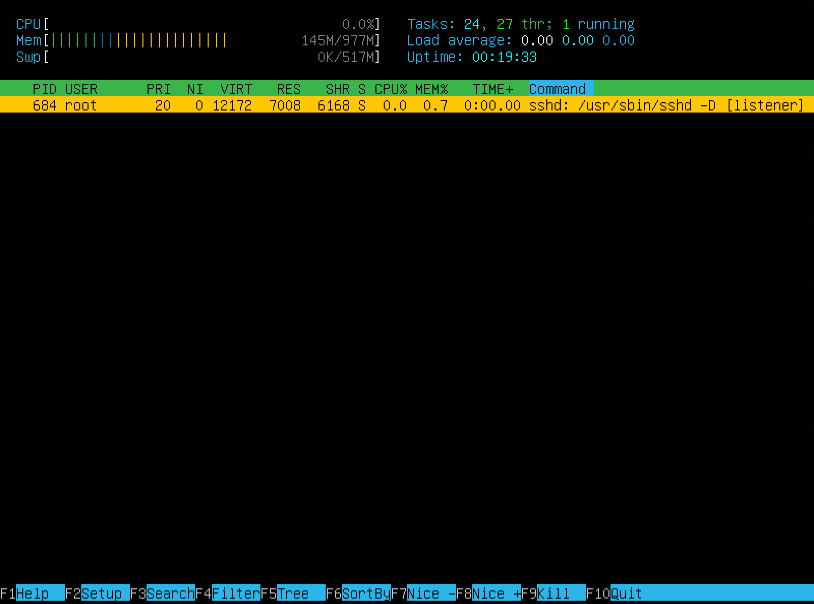

## Part 1. Installation of the OS

  `cat /etc/issue` 

  |:--:| 
| *OS version* |

## Part 2. Creating a user

  |:--:| 
| *Command to create a 'test_user' user and add him to adm group* |

`cat /etc/passwd`

  |:--:| 
| *now user 'test_user' is in adm group* |

## Part 3. Setting up the OS network

1. 

  |:--:| 
| *Сhanging machine name to 'user-1'* |

2. 

  |:--:| 
| *Setting time zone* |

3. 

  |:--:| 
| *Checking network interfaces* |

>lo is the loopback interface. \
>This is a special network interface that the system uses to communicate with itself. It is a set of methods necessary to correct the router's operation and data transmission. \
>The interface is needed to display processes in the router.

4. 

  |:--:| 
| *Getting current DHCP server ip-address* |

>DHCP (Dynamic Host Configuration Protocol) is a protocol that automatically configuring device's IP adresses. \
>It takes 4 steps to configure IP to client, this process named DORA: \
>D: Discover \
>O: Offer \
>R: Request \
>A: Acknowledgement

5. 

  |:--:| 
| *Getting internal and external ip-addresses* |

6. 

  |:--:|

| *Setting static ip address* |

7. 

  |:--:|

| *Checking changes* |

## Part 4. OS Update

  |:--:|
| *Updating OS* |

## Part 5. Using the sudo command

  |:--:|
| *Giving sudo rights to 'test_user'* |

> The sudo command allows us to run programs with the security privileges of another user (by default, as the superuser).

  |:--:|
| *Changing hostname using 'test_user'* |

## Part 6. Installing and configuring the time service

  |:--:|
| *Checking time service* |

## Part 7. Installing and using text editors

1. *==VIM==*

  |:--:|

\
| *Using VIM* |

  >to enter editing mode press 'i' \
  >to exit editing mode press ESC \
  >to save & exit type ':wq' and then press ENTER \
  >to exit without saving changes type ':q' press ENTER \
  >to search /<search text> \
  >to search & replace :s/<search text>/<replacement text>

2. *==NANO==*

  |:--:|

| *Using NANO* |

  >to save & exit press control (^) + X and then type Y and press ENTER two times \
  >to exit without saving changes press control (^) + X and then type N and press ENTER \
  >search: Control (^) + W \
  >replace: Option (⌥) + R \

3. *==MCEDIT==_*

  |:--:|

| *Using MCEDIT* |

  >to save & exit fn+F10 and choose Yes \
  >to exit without saving changes fn+F10 and choose No \
  >search: fn+F7 \
  >replace: fn+F4

## Part 8. Installing and basic setup of the SSHD service

1. 

  |:--:|
| *installing SSHd* |

2. 

  |:--:|
| *enabling ssh autostart* |

3. 

  |:--:|

| *Resetting ssh ports to 2022* |

4. 

  |:--:|
| *showing sshd in procces via PID* |

`netstat -tan`

> --numeric , -n to show network addresses as numbers \
>-a, --all to show status of all sockets \
>-t --tcp to display only tcp connections \

>Output Columns: \
>Proto - protocol used by the socket \
>Recv-Q - shows the number of bytes not copied by the program connected to the socket \
>Send-Q - shows the number of bytes not recognized (confirmed) by the remote host \
>Local Address - Local computer IP address and port number used Foreign Address - IP address and port number of the remote computer to which the socket is connected \
> State - socket status \
> 0.0.0.0 - This is a non-routable meta address that is used to identify an unknown or invalid target. In terms of servers, 0.0.0.0 means all IPv4 addresses on the local machine. In the case of a route entry, this means the default route \

## Part 9. Installing and using the top, htop utilities

uptime: 9 min \
user: 1 \
load average: 0.00, 0.02, 0.03 \
Tasks total: 94 \
%Cpu(s): 0,0, 0.0 sy, 0.0 ni, 100.0 id, 0.0 wa, 0.0 hi, 0.0 si, 0.0 st \
MiB Mem: 508.4 free, 144.8 used 323.7 buff/cache \
most %MEM pid: 641 \
most %CPU pid: 1

## Part 10. Using the fdisk utility

## Part 11. Using the df utility

Partition size: 4299472 \
Used: 3120460 \
Free space: 940012 \
Use%: 77 \
Units: 1Kb

_Human readable_
Partition size: 4.2G \
Used: 3.0G \
Free space: 918M \
Use%: 77% \
Type: ext4

## Part 12. Using the du utility

## Part 13. Installing and using the ncdu utility

## Part 14. Working with system logs
Aug 10 18:23:38 user-1 by LOGIN

## Part 15. Using the CRON job scheduler

