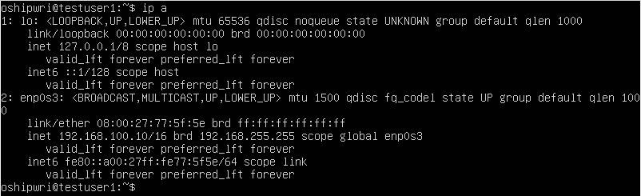
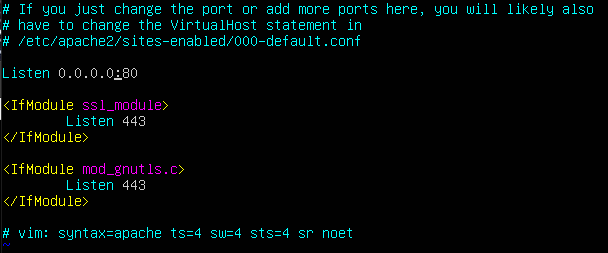
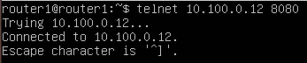

## Part 1. Инструмент ipcalc.

## 1.1 Сети и маски:
Адрес сети 192.167.38.54/13

Перевод маски 255.255.255.0 в префиксную и двоичную запись

    * /15 в обычную и двоичную

    

    * 11111111.11111111.11111111.11110000 в обычную и префиксную
    
    

Минимальный и максимальный хост в сети 12.167.38.4 при масках; 
* /8:

    

* 11111111.11111111.00000000.00000000:

    
* 255.255.254.0:

    
* /4:

    

## 1.2 localhost:

Определить и записать в отчёт, можно ли обратиться к приложению, работающему на localhost, со следующими IP: 194.34.23.100/16, 127.0.0.2/24, 127.1.0.1/8, 128.0.0.1/8
* 194.34.23.100/16, 128.0.0.1/8 - не являются петлей lo, обратиться нельзя
* 127.0.0.2/24, 127.1.0.1/8 - являются Loopback, обращение возможно

## 1.3 Диапазоны и сегменты сетей
Privat ip addres: 
* 10.0.0.45/8
* 192.168.4.2/16
* 172.20.250.4/12
* 192.172.0.1/12 Частично
* 172.16.255.255/12
* 10.10.10.10/8
    
Public:
* 134.43.0.2/16
* 172.0.2.1/12
* 172.68.0.2/12
* 192.169.168.1/16

Какие из перечисленных IP адресов шлюза возможны у сети 10.10.0.0/18:
1. 10.10.0.2
2. 10.10.10.10

## Part 2. Статическая маршрутизация между двумя машинами

С помощью команды ip a посмотреть существующие сетевые интерфейсы

* ws1:
    
* ws2:
    

Описать сетевой интерфейс, соответствующий внутренней сети, на обеих машинах и задать следующие адреса и маски: ws1 - 192.168.100.10, маска /16, ws2 - 172.24.116.8, маска /12

* ws 1:
    
* ws 2:
    

Выполнить команду netplan apply для перезапуска сервиса сети

* ws 1:
    
* ws 2:
    

## 2.1. Добавление статического маршрута вручную

Добавить статический маршрут от одной машины до другой и обратно при помощи команды вида ip r add

Пропинговать соединение между машинами

* ws 1:
    
* ws 2:
    

## 2.2. Добавление статического маршрута с сохранением

Добавить статический маршрут от одной машины до другой с помощью файла 

* ws 1:
    
* ws 2:
    

Пропинговать соединение между машинами

* ws 1:
    
* ws 2:
    

## Part 3. Утилита iperf3

## 3.1. Скорость соединения

Перевести и записать в отчёт: 8 Mbps в MB/s, 100 MB/s в Kbps, 1 Gbps в Mbps

8 Mbps = 1 Mb/s. 
100 MB/s = 100000 Kbps.
1 Gbps = 1000 Mbps.

## 3.2. Утилита iperf3

iperf3 -s -- запустить сервер
iperf3 -c 192.xxx.xxx.xxx -- обращение к серверу

Измерить скорость соединения между ws1 и ws2:

## Part 4. Сетевой экран

Создать файл /etc/firewall.sh, имитирующий фаерволл, на ws1 и ws2.

Нужно добавить в файл подряд следующие правила:

1) на ws1 применить стратегию когда в начале пишется запрещающее правило, а в конце пишется разрешающее правило (это касается пунктов 4 и 5)

2) на ws2 применить стратегию когда в начале пишется разрешающее правило, а в конце пишется запрещающее правило (это касается пунктов 4 и 5)

3) открыть на машинах доступ для порта 22 (ssh) и порта 80 (http)

4) запретить echo reply (машина не должна "пинговаться”)

5) разрешить echo reply (машина должна "пинговаться")

ws1 (left), ws2 (rigth)

Запустить файлы на обеих машинах командами chmod +x /etc/firewall.sh и /etc/firewall.sh

ws1:

ws1:

* Разница в стратегиях. Первая звучит так, запрещенно всё, что явно не разрешенно. Вторая звучит наоборот. Разрешенно всё, что явным образом не запрещенно. Первая модель предпочтительнее с точки зрения безопасности.

## 4.2. Утилита nmap

Командой ping найти машину, которая не "пингуется", после чего утилитой nmap показать, что хост машины запущен

ws1 ping -> ws2
+ nmap

ws2 ping -> ws1

## Part 5. Статическая маршрутизация сети

## 5.1. Настройка адресов машин

Настроить конфигурации машин в etc/netplan/00-installer-config.yaml согласно сети на рисунке.

* В отчёт поместить скрины с содержанием файла etc/netplan/00-installer-config.yaml для каждой машины.

* В отчёт поместить скрины с вызовом и выводом использованных команд.

ws1 -> r1

ws22 -> ws21

## 5.2. Включение переадресации IP-адресов

* выполните команду на роутерах:
sysctl -w net.ipv4.ip_forward=1

Откройте файл /etc/sysctl.conf и добавьте в него следующую строку:

net.ipv4.ip_forward = 1

В отчёт поместить скрин с содержанием изменённого файла /etc/sysctl.conf.

## 5.3. Установка маршрута по-умолчанию

Настроить маршрут по-умолчанию (шлюз) для рабочих станций.
* В отчёт поместить скрин с содержанием файла etc/netplan/00-installer-config.yaml

Вызвать ip r и показать, что добавился маршрут в таблицу маршрутизации

* В отчёт поместить скрин с вызовом и выводом использованной команды.

Пропинговать с ws11 роутер r2 и показать на r2, что пинг доходит. Для этого использовать команду:
* tcpdump -tn -i eth1

## 5.4 Добавление статических маршрутов

Вызвать ip r и показать таблицы с маршрутами на обоих роутерах.

* В отчёт поместить скрин с вызовом и выводом использованной команды.

Запустить команды на ws11:

ip r list 10.10.0.0/[маска сети] и ip r list 0.0.0.0/0

В отчёте объяснить, почему для адреса 10.10.0.0/[маска сети] был выбран маршрут, отличный от 0.0.0.0/0, хотя он попадает под маршрут по-умолчанию.

Маршрут по-умолчанию выбиратся в том случае когда таблица маршрутов не содержит вызываемого ip адреса.

## 5.5. Построение списка маршрутизаторов

Запустить на r1 команду дампа
tcpdump -tnv -i eth0

Она отправляет пакет с TTL=1 и смотрит адрес ответившего узла, дальше TTL=2, TTL=3 и так пока не достигнет цели. Каждый раз отправляется по три пакета и для каждого из них измеряется время прохождения. Пакет отправляется на случайный порт, который, скорее всего, не занят. TTL -- по русски это время жизни пакета, ищмеряется в пройденых узлах.

## 5.6. Использование протокола ICMP при маршрутизации

* Запустить на r1 перехват сетевого трафика, проходящего через eth0 с помощью команды:
tcpdump -n -i eth0 icmp

* Пропинговать с ws11 несуществующий IP (например, 10.30.0.111) с помощью команды:
ping -c 1 10.30.0.111

В отчёт поместить скрин с вызовом и выводом использованных команд.

## Part 6. Динамическая настройка IP с помощью DHCP.

* Указать MAC адрес у ws11, для этого в etc/netplan/00-installer-config.yaml надо добавить строки: macaddress: 10:10:10:10:10:BA, dhcp4: true.

Для r2 настроить в файле /etc/dhcp/dhcpd.conf конфигурацию службы DHCP:

1) указать адрес маршрутизатора по-умолчанию, DNS-сервер и адрес внутренней сети.

* Перезагрузить службу DHCP командой systemctl restart isc-dhcp-server. Машину ws21 перезагрузить при помощи reboot и через ip a показать, что она получила адрес. Также пропинговать ws22 с ws21.

ping ws2 --> ws1

* Для r1 настроить аналогично, но сделать выдачу адресов с жесткой привязкой к MAC-адресу (ws11). Провести аналогичные тесты.

* Запросить с ws21 обновление ip адреса.

Использовал:

1) sudo dhclient -v
2) sudo dhclietn -r
3) sudo dhclient -v

## Part 7. NAT

В файле /etc/apache2/ports.conf на ws22 и r2 изменить строку Listen 80 на Listen 0.0.0.0:80, то есть сделать сервер Apache2 общедоступным.

ws21:

Запустить веб-сервер Apache командой service apache2 start на ws22 и r1

* В отчёт поместить скрины с вызовом и выводом использованной команды.

Добавить в фаервол, созданный по аналогии с фаерволом из Части 4, на r2 следующие правила:
Удаление правил в таблице filter - iptables -F

Удаление правил в таблице "NAT" - iptables -F -t nat

Отбрасывать все маршрутизируемые пакеты - iptables --policy FORWARD DROP

Проверить соединение между ws22 и r1 командой ping

При запуске файла с этими правилами, ws22 не должна "пинговаться" с r1

Добавить в файл ещё одно правило:

Разрешить маршрутизацию всех пакетов протокола ICMP

Проверить соединение между ws22 и r1 командой ping

В отчёт поместить скрины с вызовом и выводом использованной команды.

Добавить в файл ещё два правила:

Включить SNAT, а именно маскирование всех локальных ip из локальной сети, находящейся за r2 (по обозначениям из Части 5 - сеть 10.20.0.0)

Включить DNAT на 8080 порт машины r2 и добавить к веб-серверу Apache, запущенному на ws22, доступ извне сети.

Проверить соединение по TCP для SNAT, для этого с ws22 подключиться к серверу Apache на r1 командой:

Проверить соединение по TCP для DNAT, для этого с r1 подключиться к серверу Apache на ws22 командой telnet (обращаться по адресу r2 и порту 8080)

## Part 8. Дополнительно. Знакомство с SSH Tunnels

Запустить веб-сервер Apache на ws22 только на localhost (то есть не изменять файл /etc/apache2/ports.conf или, если был изменен ранее, вернуть строку Listen 80)

Воспользоваться Local TCP forwarding с ws21 до ws22, чтобы получить доступ к веб-серверу на ws22 с ws21

Воспользоваться Remote TCP forwarding c ws11 до ws22, чтобы получить доступ к веб-серверу на ws22 с ws11

Для проверки, сработало ли подключение в обоих предыдущих пунктах, перейдите во второй терминал (например, клавишами Alt + F2) и выполните команду:

telnet 127.0.0.1 [локальный порт]

